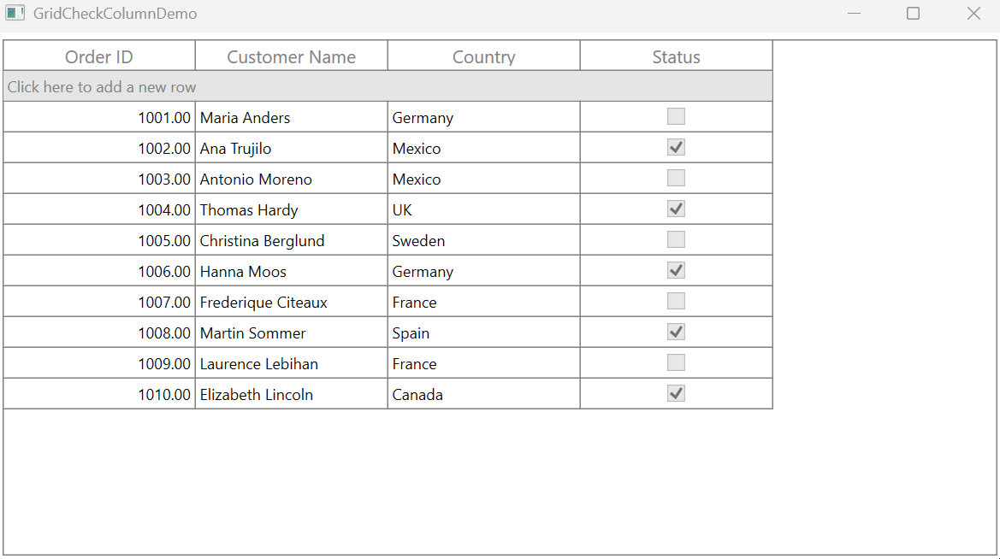

# How to avoid an InvalidOperationException when clicking AddNewRow while AllowEditing property is disabled for GridCheckBoxColumn in WPF DataGrid?

In [WPF DataGrid](https://www.syncfusion.com/wpf-controls/datagrid) (SfDataGrid), an InvalidOperationException will occur when attempting to add a new row for GridCheckBoxColumn while the [AllowEditing](https://help.syncfusion.com/cr/wpf/Syncfusion.UI.Xaml.Grid.GridColumnBase.html#Syncfusion_UI_Xaml_Grid_GridColumnBase_AllowEditing) property is **false**. This issue arises because the property bound to the [GridCheckBoxColumn](https://help.syncfusion.com/cr/wpf/Syncfusion.UI.Xaml.Grid.GridCheckBoxColumn.html) is read-only and provides only a getter.

The **AddNewRow** process is typically handled within the checkbox click event. This event depends on the IsHitTestVisible property. When **IsHitTestVisible** is set to false, the event is not triggered. This behavior is consistent with the framework's default handling of checkbox, which is influenced by the **IsReadOnly** property.

To prevent the exception, the [IsReadOnly](https://help.syncfusion.com/cr/wpf/Syncfusion.UI.Xaml.Grid.GridColumnBase.html#Syncfusion_UI_Xaml_Grid_GridColumnBase_IsReadOnly) property should be set to true for the **GridCheckBoxColumn**. This configuration avoids triggering an InvalidOperationException during the process of inserting a new row with read only property.

```xml
<syncfusion:SfDataGrid x:Name="dataGrid"   
                       ItemsSource="{Binding Orders}" 
                       AutoGenerateColumns="False"
                       AddNewRowPosition="FixedTop"
                       AllowEditing="False">
    <syncfusion:SfDataGrid.Columns>
        <syncfusion:GridNumericColumn MappingName="OrderID" 
                                      HeaderText="Order ID"/>
        <syncfusion:GridTextColumn MappingName="CustomerName" 
                                   HeaderText="Customer Name"/>
        <syncfusion:GridTextColumn MappingName="Country" 
                                   HeaderText="Country"/>
        <syncfusion:GridCheckBoxColumn MappingName="Status"
                                       HeaderText="Status"
                                       IsReadOnly="True"/>
    </syncfusion:SfDataGrid.Columns>
</syncfusion:SfDataGrid>
```



Take a moment to peruse the [WPF DataGrid - Editing](https://help.syncfusion.com/wpf/datagrid/editing) documentation, to learn more about editing with examples.